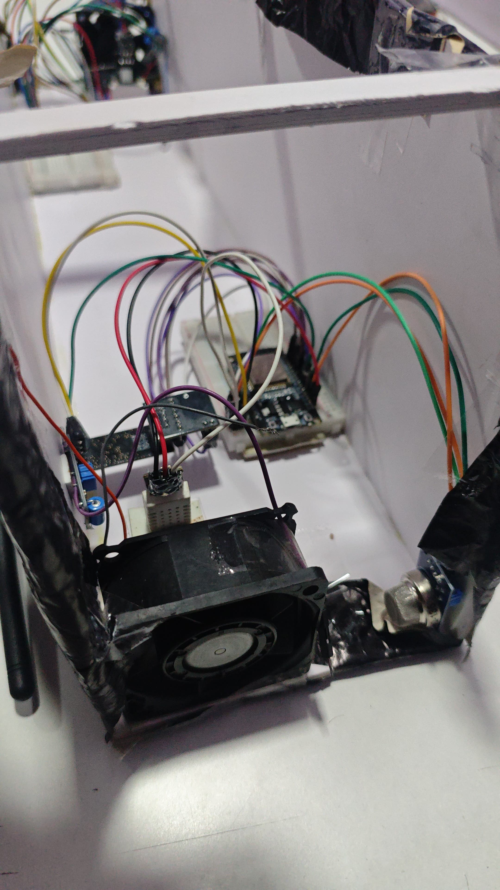

# AI-Based Tunnel Booster Fan Monitoring using TinyML (ESP32)

##  Overview

This project implements a **TinyML-based edge AI system** for monitoring tunnel booster fan conditions using an ESP32 microcontroller.

The system reads real-time temperature data from a DHT22 sensor and performs **on-device machine learning inference** using TensorFlow Lite Micro to classify operating conditions as:

*  Normal Temperature
*  Abnormal / Critical Temperature

This eliminates the need for cloud processing and enables **real-time, low-latency decision making** in industrial environments.

---

##  Problem Statement

Tunnel booster fans operate in critical underground environments where overheating or abnormal conditions can lead to:

* Equipment failure
* Safety hazards
* High maintenance costs

Traditional monitoring systems lack intelligence and real-time predictive capability.

---

##  Solution

A lightweight **TinyML-based monitoring system** that:

* Runs entirely on an ESP32
* Uses a trained ML model for classification
* Performs real-time anomaly detection
* Works without internet connectivity

---

##  Technologies Used

* ESP32 (Microcontroller)
* TensorFlow Lite Micro (TinyML)
* Arduino Framework (C++)
* DHT22 Temperature Sensor
* Embedded Systems Programming

---

##  How It Works

1. DHT22 reads temperature data
2. Data is fed into TensorFlow Lite Micro model
3. Model performs inference on-device
4. Output is classified as:

   * Normal
   * Abnormal
5. Result is printed via Serial Monitor

---

## Setup Instructions
For detailed setup steps, see [Setup Guide](setup.md)

---
##  Project Structure

```
ai-tunnel-fan/
├── src/
│   └── ai_tunnel_fan.ino
├── model/
│   ├── model_data.cc
│   └── model_data.h
├── docs/
│   └── images/
├── README.md
└── setup.md
```

---

##  My Contribution

* Developed complete embedded firmware on ESP32
* Trained ML model and converted to TensorFlow Lite format
* Integrated TensorFlow Lite Micro for on-device inference
* Built real-time sensor-to-ML pipeline
* Designed classification logic for anomaly detection

---

##  Output Example

```
Measured Temperature: 36.50
Prediction:  Bad Temperature! Take action!
```

---

## Future Improvements

* Add vibration + current sensors for multi-parameter monitoring
* Integrate IoT dashboard (MQTT / Cloud)
* Predict failure before threshold (predictive maintenance)
* Deploy on industrial-grade hardware

---

## Images



---

## Author

Dhruv Kotian

---

## License

This project is licensed under the MIT License — see the [LICENSE](LICENSE) file for details.
